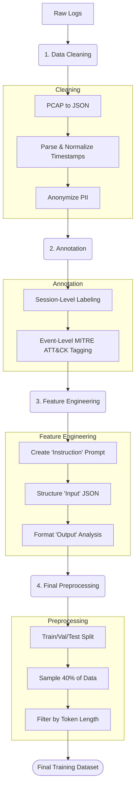

# Dataset Preparation & Feature Engineering Flowchart

This flowchart visualizes the end-to-end process of preparing the cybersecurity dataset for fine-tuning the language model.

```mermaid
graph TD
    A[Raw Logs] --> B(1. Data Cleaning);
    subgraph "Cleaning"
        B1[PCAP to JSON]
        B2[Parse & Normalize Timestamps]
        B3[Anonymize PII]
    end
    B --> B1 --> B2 --> B3;

    B3 --> C(2. Annotation);
    subgraph "Annotation"
        C1[Session-Level Labeling]
        C2[Event-Level MITRE ATT&CK Tagging]
    end
    C --> C1 --> C2;

    C2 --> D(3. Feature Engineering);
    subgraph "Feature Engineering"
        D1[Create 'Instruction' Prompt]
        D2[Structure 'Input' JSON]
        D3[Format 'Output' Analysis]
    end
    D --> D1 --> D2 --> D3;

    D3 --> E(4. Final Preprocessing);
    subgraph "Preprocessing"
        E1[Train/Val/Test Split]
        E2[Sample 40% of Data]
        E3[Filter by Token Length]
    end
    E --> E1 --> E2 --> E3;

    E3 --> F([Final Training Dataset]);
```
