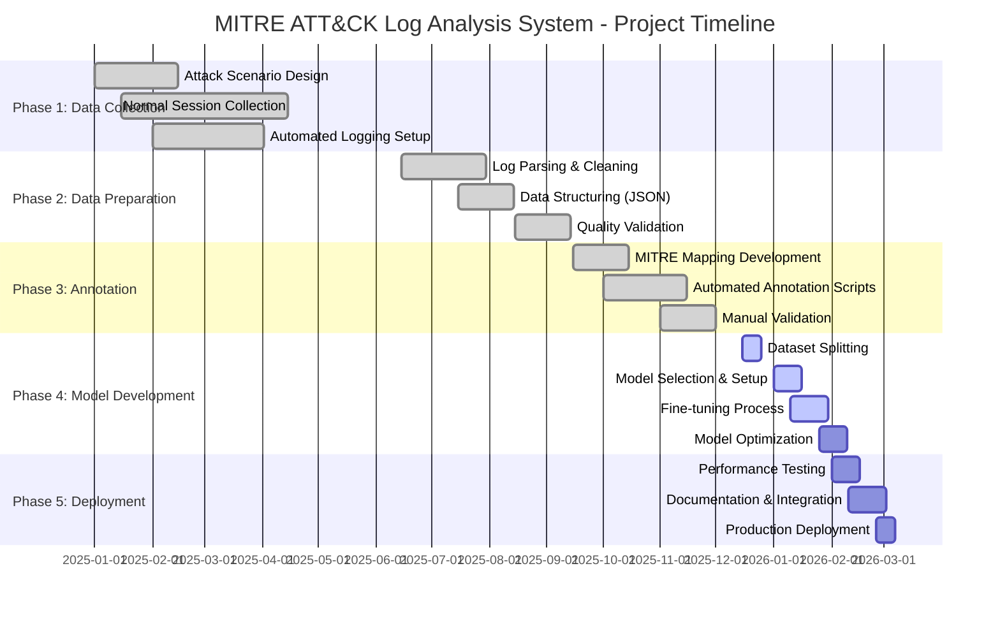

# Software Requirements Specification (SRS)

# MITRE ATT&CK Log Analysis System

## System Log Analysis Tool for Detecting and Explaining Suspicious Computer Activities

**Version:** 1.0  
**Date:** January 11, 2026  
**Project Team:** Cybersecurity Research Group

---

## 1. Introduction

Manual analysis of system logs is both time-consuming and error-prone. Security analysts must sift through thousands of log entries to identify potential threats, a process that becomes increasingly challenging as systems generate massive volumes of data. Hidden attacks can remain undetected for weeks or months, allowing adversaries to establish persistence, escalate privileges, and exfiltrate sensitive data. The lack of automated, intelligent analysis tools means that organizations often discover breaches only after significant damage has occurred.

Introducing **MITRE ATT&CK Log Analysis System**: An intelligent solution to automate the detection and explanation of suspicious computer activities. This tool acts as a vigilant sentinel that continuously monitors system, process, and network logs to identify anomalous behavior patterns indicative of cyber attacks. By analyzing logs in structured time segments and mapping detected activities to the MITRE ATT&CK framework, the system provides actionable intelligence that enables rapid incident response. The system not only detects threats but also explains them in the context of attacker tactics, techniques, and procedures (TTPs), transforming raw log data into comprehensible security insights.

### 1.1 Motivation

Consider a scenario where an attacker gains initial access to a corporate network. Over the next 20 minutes, they execute several malicious activities:

1. PowerShell process launches with suspicious command-line parameters
2. Unauthorized registry modifications to establish persistence
3. Multiple failed login attempts followed by successful privileged access
4. Unusual outbound network connections to unknown IP addresses
5. Large data transfers to external servers

Each of these events generates log entries across different systems—Windows Event Logs, Sysmon, network traffic logs, and browser activity logs. A security analyst would need to manually correlate these events, understand their significance, and determine whether they represent a coordinated attack. This process could take hours or days, during which the attacker continues to operate undetected.

The challenge intensifies when dealing with legitimate administrative activities that may appear similar to attack patterns. For instance, a system administrator using PowerShell for routine tasks might generate log patterns resembling those of a malicious script execution. Distinguishing between benign and malicious behavior requires deep expertise in both system administration and cyber threat intelligence.

Research in automated threat detection has shown promising results. The MITRE ATT&CK framework [1] provides a comprehensive knowledge base of adversary tactics and techniques observed in real-world attacks. Studies on log-based intrusion detection [2] demonstrate that machine learning models can identify anomalous patterns with high accuracy. Furthermore, recent advances in language models [3] enable the generation of human-readable explanations for complex security events.

Inspired by these insights and feedback from cybersecurity professionals, we recognized the urgent need for an intelligent system that can:

- Automatically analyze multi-source log data in real-time
- Detect suspicious activity patterns using advanced ML techniques
- Map detected behaviors to MITRE ATT&CK tactics and techniques
- Generate clear, actionable reports for security analysts
- Reduce the time from threat detection to incident response

### 1.2 Project Description

In cybersecurity, threat detection systems traditionally rely on signature-based rules or simple anomaly detection, which often generate high false-positive rates and fail to detect sophisticated attacks. System logs contain valuable forensic evidence, but extracting meaningful insights requires correlating events across multiple log sources, understanding normal baseline behavior, and recognizing attack patterns that may span extended time periods.

To address these challenges, the **MITRE ATT&CK Log Analysis System** is proposed as an end-to-end solution for automated threat detection and explanation. The goal is to transform raw, unstructured log data into actionable security intelligence by leveraging machine learning and the MITRE ATT&CK framework.

The core problem we aim to solve is the **lack of automated, context-aware log analysis** that can identify complex attack patterns and explain them in terms security analysts understand. The system will process logs from multiple sources (system logs, process execution logs, network traffic, browser activity), segment them into temporal chunks, and analyze each segment for suspicious behavior patterns.

By fine-tuning a large language model on labeled attack and normal session data, the tool will:

1. **Classify sessions** as normal or suspicious with high confidence
2. **Identify specific MITRE ATT&CK techniques** present in suspicious sessions
3. **Generate detailed explanations** of detected threats, including relevant timestamps and IOCs (Indicators of Compromise)
4. **Provide actionable recommendations** for incident response

The system consists of several integrated pipelines:

- **Data Collection Pipeline**: Automated logging of system events, process execution, network traffic, and browser activity
- **Data Preparation Pipeline**: Cleaning, parsing, and structuring raw logs into JSON format
- **Annotation Pipeline**: Labeling sessions as normal/suspicious and tagging with MITRE ATT&CK technique IDs
- **Model Training Pipeline**: Fine-tuning language models for threat classification and explanation generation
- **Analysis Pipeline**: Real-time or batch processing of log data to detect and explain threats

Additionally, the system integrates with a complementary video-based monitoring system developed by project partners, enabling correlation between user screen activity and internal system behavior for comprehensive threat analysis.

### 1.3 Project Scope

The scope of the MITRE ATT&CK Log Analysis System is delineated below:

**In Scope:**

- Multi-source log collection (Windows Event Logs, Sysmon, network traffic, browser activity)
- Automated data preprocessing and cleaning pipeline
- MITRE ATT&CK-based annotation system for threat labeling
- Fine-tuned language model for threat detection and classification
- Session-based analysis with 7-log temporal chunking
- Real-time and batch processing modes
- Report generation with detected techniques, timestamps, and explanations
- Integration with video-based monitoring system
- Support for 100+ attack scenarios across MITRE ATT&CK tactics
- Dataset comprising ~100 attack sessions and ~1000 normal sessions
- Privacy-preserving data collection and storage mechanisms

**Out of Scope:**

- Active threat remediation or automated response actions
- Analysis of encrypted network traffic without decryption keys
- Mobile or IoT device log analysis
- Cloud-native application log analysis (AWS CloudTrail, Azure logs, etc.)
- Compliance reporting (GDPR, HIPAA, PCI-DSS)
- Integration with SIEM platforms (planned for future versions)

### 1.4 Timeline

The estimated timeline for the MITRE ATT&CK Log Analysis System is delineated below:



**Key Milestones:**

- **Phase 1 Complete (June 2025)**: ✅ All log data collected and validated
- **Phase 2 Complete (September 2025)**: ✅ Clean, structured dataset ready for annotation
- **Phase 3 Complete (December 2025)**: ✅ Fully annotated dataset with MITRE ATT&CK labels
- **Phase 4 In Progress (January 2026)**: 🔄 Fine-tuning model (expected completion: early February 2026)
- **Phase 5 Planned (February 2026)**: 📅 Production deployment and documentation (target: early March 2026)

### 1.5 Purpose of Document

The purposes of this Software Requirements Specification document are:

- **Identify and analyze requirements**: Clearly define functional and non-functional requirements for the threat detection system
- **Design the architecture**: Specify system components, data flows, and integration points
- **Design the test plan**: Establish criteria for validating system performance and accuracy
- **Describe methodology**: Document the approach for data collection, model training, and threat analysis
- **Reduce development effort**: Provide clear specifications to minimize rework and confusion
- **Improve understanding**: Create a shared reference for all stakeholders (developers, security analysts, researchers)
- **Ensure ethical compliance**: Document privacy protections and ethical research practices
- **Facilitate maintenance**: Provide comprehensive documentation for future updates and improvements

---

## 2. Quality Function Deployment

This document outlines the Quality Function Deployment (QFD) process for the MITRE ATT&CK Log Analysis System. The development of the system's QFD began with an extensive review of cybersecurity research, drawing significant insights from the MITRE ATT&CK framework [1], machine learning-based intrusion detection studies [2], and log analysis methodologies [3]. These findings provided a deep understanding of threat detection challenges and informed our approach.

In addition to academic research, we engaged directly with key stakeholders from the cybersecurity industry. By consulting with security analysts, incident responders, and SOC (Security Operations Center) teams across various organizations, we gained valuable perspectives on their operational needs and challenges. This ensured that our system addresses real-world threat detection scenarios effectively.

### 2.1 Quality Function Deployment

Quality Function Deployment (QFD) is a technique that translates stakeholder needs into technical requirements for the software. For this project, requirements are categorized into three levels based on user expectations and impact on satisfaction.

#### 2.1.1 Normal Requirements

These are fundamental features that users expect from a threat detection system:

1. **Automated Log Collection**: The system must automatically collect logs from multiple sources (system, process, network, browser) without manual intervention, ensuring comprehensive coverage of security-relevant events.

2. **High Detection Accuracy**: The tool must achieve >85% accuracy in classifying sessions as normal or suspicious, with minimal false positives to avoid alert fatigue among security analysts.

3. **MITRE ATT&CK Mapping**: All detected suspicious activities must be mapped to relevant MITRE ATT&CK tactics and techniques, providing standardized threat intelligence that aligns with industry frameworks.

4. **Timestamped Event Logs**: Generated reports must include precise timestamps for all detected events, enabling forensic investigation and timeline reconstruction.

5. **Privacy Protection**: The system must implement data anonymization and secure storage mechanisms to protect sensitive information collected during monitoring.

#### 2.1.2 Expected Requirements

These features directly impact user satisfaction based on how well they are implemented:

1. **Context-Aware Threat Detection**: The system should analyze logs within their broader context (e.g., user role, time of day, historical patterns) to reduce false positives and improve detection accuracy.

2. **Detailed Threat Explanations**: Beyond simple classification, the tool should provide clear, jargon-free explanations of why specific activities are flagged as suspicious, helping analysts understand the threat without requiring deep technical expertise.

3. **Fast Processing Speed**: Log analysis should complete within reasonable timeframes (seconds for real-time mode, minutes for batch processing) to enable timely incident response.

4. **Comprehensive Session Reports**: Reports should include not just the verdict (normal/suspicious) but also confidence scores, detected techniques, relevant log excerpts, and recommended response actions.

5. **Integration Capabilities**: The system should provide APIs or export formats that enable integration with existing security tools (SIEM, ticketing systems, etc.).

#### 2.1.3 Exciting Requirements

These features go beyond user expectations, providing unique value that can greatly enhance satisfaction:

1. **Fine-Tuned Language Model for Threat Analysis**: Leveraging state-of-the-art language models fine-tuned specifically on cybersecurity log data introduces cutting-edge AI capabilities that can detect subtle attack patterns missed by traditional rule-based systems.

2. **Dynamic Temporal Chunking with 7-Log Segments**: The innovative approach of analyzing logs in optimized 7-event chunks (rather than arbitrary time windows) enables detection of attack sequences that unfold across multiple discrete actions, capturing the temporal nature of multi-stage attacks.

3. **Video-Log Correlation System**: The unique integration with video-based screen monitoring provides dual-perspective threat validation—correlating internal system behavior (logs) with user visual activity (screen recordings) to detect sophisticated insider threats and UI-based attacks.

4. **Automated MITRE Technique Extraction**: Using advanced NLP techniques to automatically extract and categorize attacker TTPs from log data eliminates the need for manual threat intelligence mapping, accelerating threat analysis workflows.

5. **Explainable AI with Reasoning**: The system doesn't just output "suspicious" but provides detailed reasoning chains explaining which log patterns triggered the alert, which MITRE techniques they correspond to, and why they're significant—making AI decisions transparent and trustworthy.

6. **Multi-Stage Attack Pattern Recognition**: The ability to detect coordinated attack sequences spanning initial access → persistence → privilege escalation → exfiltration provides comprehensive threat visibility that goes beyond single-event detection.

### 2.2 Usage Scenario

The MITRE ATT&CK Log Analysis System is an intelligent threat detection platform designed to streamline the process of identifying and investigating suspicious computer activities. It provides automated log collection, AI-powered threat detection, and MITRE ATT&CK-aligned reporting to help security teams maintain robust defense postures. The system transforms the time-consuming manual process of log analysis into an automated, intelligent workflow that delivers actionable threat intelligence within minutes.

#### System Deployment and Configuration

Security administrators deploy the automated logging agents on monitored systems. The agents are configured to collect:

- Windows Event Logs (security, system, application)
- Sysmon process execution logs
- Network traffic captures (DNS, HTTP/S, TCP/UDP)
- Browser activity logs (Chrome, Edge, Firefox)

Configuration includes setting collection intervals, specifying log storage locations (local or cloud), and establishing privacy controls (data anonymization, PII filtering).

#### Automated Log Collection

Once deployed, the system runs continuously in the background:

- **Screen Recording Module**: Captures user screen activity at configurable intervals
- **Packet Capture Module**: Records network traffic using promiscuous mode network adapters
- **System Log Extractor**: Pulls Windows Event Logs and Sysmon data every 5 minutes
- **Browser Log Extractor**: Collects browser history, downloads, and network requests

All collected data is timestamped, compressed, and uploaded to secure cloud storage (Google Drive with encryption) for analysis. The system handles both real-time streaming (for active monitoring) and batch processing (for historical analysis).

#### Data Preprocessing and Cleaning

Raw logs undergo automated preprocessing:

1. **Parsing**: Converts various log formats (XML, CSV, binary) into standardized JSON
2. **Cleaning**: Removes duplicate entries, filters noise, and normalizes timestamps
3. **Structuring**: Organizes logs into session-based chunks (7 consecutive events per chunk)
4. **Anonymization**: Strips personally identifiable information (usernames replaced with hashes, internal IPs masked)

The clean dataset is stored in structured format ready for analysis, with metadata preserved for forensic traceability.

#### Threat Detection and Classification

The fine-tuned language model processes each log chunk:

1. **Embedding Generation**: Converts text logs into numerical vector representations
2. **Pattern Recognition**: Compares log patterns against learned attack signatures
3. **Classification**: Outputs probability scores for "Normal" vs "Suspicious"
4. **Confidence Scoring**: Provides confidence levels (0-100%) for each prediction

For suspicious sessions, the model performs additional analysis:

- Identifies specific MITRE ATT&CK techniques present (e.g., T1059.001 - PowerShell execution)
- Extracts relevant log excerpts showing malicious activities
- Generates timestamps for attack sequence reconstruction

#### Report Generation and Explanation

When a threat is detected, the system automatically generates a comprehensive report:

```
=================================================================
THREAT DETECTION REPORT
=================================================================
Session ID: SESSION_20250111_1430_0042
Status: SUSPICIOUS
Confidence: 94.3%
Analysis Date: 2025-01-11 14:30:15 UTC
-----------------------------------------------------------------

DETECTED MITRE ATT&CK TECHNIQUES:
1. T1059.001 - PowerShell (Command and Scripting Interpreter)
2. T1547.001 - Registry Run Keys / Startup Folder (Persistence)
3. T1041 - Exfiltration Over C2 Channel

-----------------------------------------------------------------
ATTACK TIMELINE:
14:28:45 - PowerShell process launched with encoded command
           Command: powershell.exe -enc <base64_payload>

14:29:12 - Registry modification detected
           Path: HKLM\Software\Microsoft\Windows\CurrentVersion\Run
           Action: New value "SecurityUpdate" added

14:29:58 - Unusual outbound connection established
           Destination: 185.220.101.45:443 (TOR exit node)
           Data transferred: 47.3 MB

-----------------------------------------------------------------
THREAT SUMMARY:
This session exhibits behaviors consistent with a multi-stage
cyber attack. The attacker used PowerShell to execute encoded
commands (likely bypassing antivirus), established persistence
through registry modification, and exfiltrated data to a TOR
network endpoint. This pattern matches APT-style intrusion
techniques commonly associated with espionage campaigns.

RECOMMENDED ACTIONS:
1. Isolate affected system from network immediately
2. Capture memory dump for forensic analysis
3. Review all recent logins and privilege escalations
4. Check for lateral movement to other systems
5. Report to incident response team

Risk Level: CRITICAL
=================================================================
```

The report is saved in both human-readable (TXT/PDF) and machine-readable (JSON) formats for integration with ticketing systems and SIEM platforms.

#### Integration with Video Monitoring System

For enhanced threat validation, logs are correlated with screen recordings:

- **Temporal Alignment**: Video timestamps are synchronized with log event times
- **Activity Correlation**: Visual screen actions (mouse clicks, keyboard input) are matched with process execution logs
- **Insider Threat Detection**: Detects scenarios where users intentionally perform malicious actions (e.g., copying sensitive files to USB drives)
- **False Positive Reduction**: Legitimate administrative activities visible in screen recordings help filter out benign PowerShell usage

The dual-perspective analysis provides comprehensive visibility into both system internals and user behavior.

#### Continuous Learning and Model Improvement

The system supports continuous improvement through:

- **Feedback Loop**: Security analysts can mark detections as true positives or false positives
- **Model Retraining**: Periodically fine-tune the model with newly labeled data
- **Technique Updates**: Regularly update MITRE ATT&CK mappings as new techniques are published
- **Performance Monitoring**: Track detection accuracy, false positive rates, and response times

This ensures the system evolves to detect emerging threats and maintains high performance over time.

---

**References:**

1. MITRE ATT&CK Framework - https://attack.mitre.org
2. Machine Learning for Intrusion Detection: A Survey (Buczak & Guven, 2016)
3. Deep Learning for Log Analysis and Anomaly Detection (Du et al., 2017)
