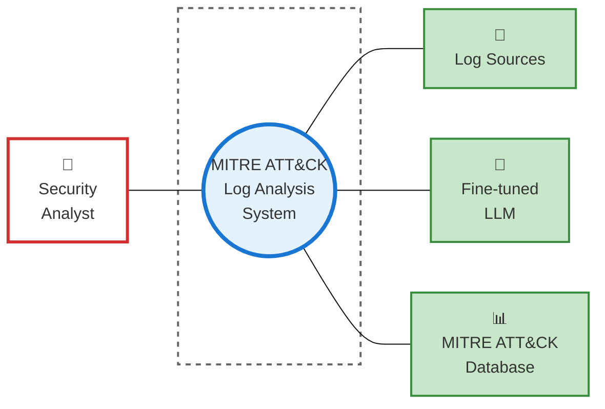
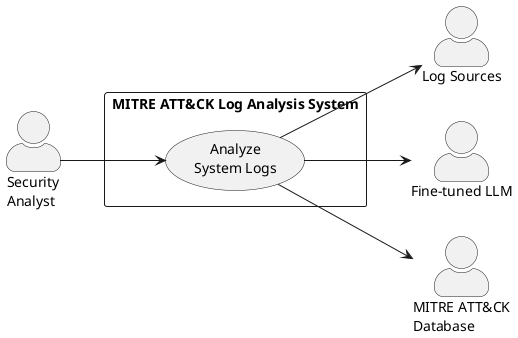
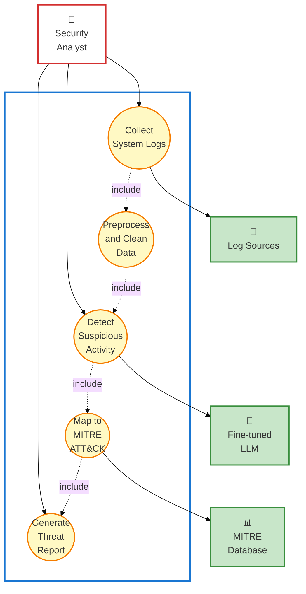

# 3. Scenario-Based Modeling

Scenario-based modeling is a method used in software development and design to create models that illustrate how a system behaves or responds to different real-world situations or scenarios. These scenarios are usually based on user interactions, events, or conditions, helping developers visualize and understand how the software will function in various contexts. By simulating these scenarios, developers can identify potential issues, make informed design choices, and ensure that the software meets user needs in diverse usage situations.

## 3.1 Use Case Diagram

A use case diagram is a visual tool in software engineering that depicts how a system interacts with external entities or actors to accomplish specific tasks or goals. It shows the connections between use cases (which represent system functions) and actors (which represent external users or systems). Use case diagrams are typically created during the requirements gathering phase, where system functionalities and user interactions are identified and then mapped out using specialized modeling tools.

### 3.1.1 Level 0:

**Option 1: Mermaid (Simplified UML-style)**



**Option 2: PlantUML (True UML Standard - Recommended for formal documentation)**



> **Note:** To render PlantUML diagrams in VS Code, install the "PlantUML" extension. PlantUML provides true UML compliance and professional-looking diagrams matching the PyTypeWizard format.

**Figure 3:** UseCase Level 0 (MITRE ATT&CK Log Analysis System)

**Name:** MITRE ATT&CK Log Analysis System Overview

**Primary Actors:** Security Analyst

**Secondary Actors:** Log Sources (System Logs, Network Logs, Browser Logs), Fine-tuned LLM, MITRE ATT&CK Database

**Goal in Context:** The diagram above illustrates the complete system overview for the MITRE ATT&CK Log Analysis System, a tool designed for detecting and explaining suspicious computer activities through automated log analysis.

---

### 3.1.2 Level 1:

**Option 1: Mermaid (Simplified UML-style)**




**Figure 4:** UseCase Level 1 (Modules of MITRE ATT&CK Log Analysis System)

**Name:** Modules of MITRE ATT&CK Log Analysis System

**Primary Actors:** Security Analyst

**Secondary Actors:** Log Sources, Fine-tuned LLM, MITRE ATT&CK Database

**Goal in Context:** The diagram above shows the modules of the MITRE ATT&CK Log Analysis System. It consists of 5 core modules which are further elaborated below:

---

## 3.2 Module Descriptions

### 1. Collect System Logs

**Functionality:** This module activates when the system begins monitoring a target machine or when a security analyst initiates log collection. It deploys automated logging agents that continuously capture data from multiple sources:

- Windows Event Logs (Security, System, Application)
- Sysmon process execution logs
- Network packet captures (DNS, HTTP/S, TCP/UDP)
- Browser activity logs (Chrome, Edge, Firefox)

**Purpose:** Ensures comprehensive coverage of security-relevant events by gathering data from all critical logging sources. The module operates in the background without impacting system performance.

**Key Dependencies:** Requires privileged access to system resources and network interfaces. Integrates with cloud storage (Google Drive) for secure log backup.

**Key Role:** Acts as the data acquisition layer for the entire threat detection pipeline. Without comprehensive log collection, the system cannot identify attack patterns.

---

### 2. Preprocess and Clean Data

**Functionality:** Processes raw logs collected from various sources and transforms them into a standardized, analyzable format. This module performs:

- **Parsing:** Converts diverse log formats (XML, CSV, JSON, binary) into unified JSON structure
- **Cleaning:** Removes duplicate entries, filters system noise, and normalizes inconsistent timestamp formats
- **Structuring:** Organizes logs into session-based temporal chunks (7 consecutive events per chunk)
- **Anonymization:** Strips personally identifiable information (PII) by hashing usernames and masking internal IP addresses

**Purpose:** Transforms noisy, unstructured raw data into clean, structured datasets ready for machine learning analysis. This step is critical for achieving high detection accuracy.

**Key Dependencies:** Works closely with the **Log Sources** to understand different log schemas and with the **Fine-tuned LLM** preprocessing requirements.

**Output:** Produces clean JSON files organized by sessions, with each session containing multiple 7-log chunks. Metadata is preserved for forensic traceability.

---

### 3. Detect Suspicious Activity

**Functionality:** Analyzes preprocessed log chunks using the fine-tuned language model to identify anomalous patterns indicative of cyber attacks. The module performs:

- **Embedding Generation:** Converts text-based logs into numerical vector representations
- **Pattern Recognition:** Compares current log patterns against learned attack signatures from training data
- **Binary Classification:** Outputs probability scores determining whether a session is "Normal" or "Suspicious"
- **Confidence Scoring:** Provides confidence levels (0-100%) for each prediction

**Purpose:** Serves as the core threat detection engine, leveraging AI to identify subtle attack patterns that traditional rule-based systems miss.

**Key Dependencies:**

- Relies heavily on the **Fine-tuned LLM** for pattern recognition and classification
- Uses preprocessed data from the **Preprocess and Clean Data** module
- Applies learned patterns from the training dataset (100 attack sessions + 1000 normal sessions)

**Output:** Flags suspicious sessions with confidence scores and passes them to the MITRE mapping module for technique identification.

---

### 4. Map to MITRE ATT&CK

**Functionality:** For sessions flagged as suspicious, this module identifies specific MITRE ATT&CK techniques present in the attack sequence. It performs:

- **Technique Extraction:** Uses the fine-tuned LLM to analyze log patterns and extract relevant MITRE technique IDs (e.g., T1059.001 for PowerShell execution)
- **Tactic Classification:** Maps techniques to broader MITRE tactics (Initial Access, Persistence, Privilege Escalation, etc.)
- **Timeline Reconstruction:** Identifies the sequence of attacker actions and their timestamps
- **IOC Identification:** Extracts Indicators of Compromise such as suspicious IP addresses, file hashes, and command-line arguments

**Purpose:** Translates raw detection results into standardized threat intelligence aligned with industry frameworks. This enables security analysts to understand **what** the attacker did and **how** they did it.

**Key Dependencies:**

- Integrates with the **MITRE ATT&CK Database** to validate technique IDs and descriptions
- Uses the **Fine-tuned LLM** for context-aware technique extraction
- Receives suspicious session data from the **Detect Suspicious Activity** module

**User Interaction:** Security analysts can review the mapped techniques and validate the system's classifications, providing feedback for model improvement.

---

### 5. Generate Threat Report

**Functionality:** Creates comprehensive, human-readable reports summarizing detected threats. The module produces:

- **Executive Summary:** High-level verdict (Normal/Suspicious) with overall confidence score
- **MITRE Technique List:** All detected ATT&CK techniques with descriptions
- **Attack Timeline:** Chronological sequence of malicious events with precise timestamps
- **Detailed Evidence:** Relevant log excerpts showing suspicious activities
- **Threat Explanation:** Plain-language explanation of what happened and why it's significant
- **Recommended Actions:** Incident response steps (isolate system, capture forensics, investigate lateral movement, etc.)
- **Risk Assessment:** Categorization of threat severity (Low, Medium, High, Critical)

**Purpose:** Transforms technical detection results into actionable intelligence that security teams can immediately act upon. The report bridges the gap between AI outputs and human decision-making.

**Key Dependencies:**

- Aggregates data from **Detect Suspicious Activity** and **Map to MITRE ATT&CK** modules
- Stores reports in both human-readable (PDF/TXT) and machine-readable (JSON) formats

**Key Role:** Serves as the final output interface, delivering value to end users (security analysts, incident responders, SOC teams). The quality of these reports directly impacts the system's usability and adoption.

---

## 3.3 Data Flow Diagram

```js
flowchart TD
    Start([Security Analyst<br/>Initiates Analysis])

    Collect[Module 1:<br/>Collect System Logs]
    Preprocess[Module 2:<br/>Preprocess and Clean Data]
    Detect[Module 3:<br/>Detect Suspicious Activity]
    Map[Module 4:<br/>Map to MITRE ATT&CK]
    Report[Module 5:<br/>Generate Threat Report]

    Decision{Suspicious<br/>Activity?}

    End([Report Delivered<br/>to Analyst])

    LogDB[(Raw Logs)]
    CleanDB[(Clean JSON Logs)]
    LLM[Fine-tuned LLM]
    MITRE[(MITRE Database)]

    Start --> Collect
    Collect --> LogDB
    LogDB --> Preprocess
    Preprocess --> CleanDB
    CleanDB --> Detect
    Detect --> LLM
    LLM --> Decision

    Decision -->|Normal| Report
    Decision -->|Suspicious| Map
    Map --> MITRE
    Map --> Report
    Report --> End

    style Start fill:#FFB3BA,stroke:#333,stroke-width:2px
    style End fill:#B3FFB3,stroke:#333,stroke-width:2px
    style Decision fill:#FFD9B3,stroke:#333,stroke-width:3px
    style Collect fill:#FFE6B3,stroke:#333,stroke-width:2px
    style Preprocess fill:#FFE6B3,stroke:#333,stroke-width:2px
    style Detect fill:#FFE6B3,stroke:#333,stroke-width:2px
    style Map fill:#FFE6B3,stroke:#333,stroke-width:2px
    style Report fill:#FFE6B3,stroke:#333,stroke-width:2px
    style LogDB fill:#E1BEE7,stroke:#333,stroke-width:2px
    style CleanDB fill:#E1BEE7,stroke:#333,stroke-width:2px
    style LLM fill:#C8E6C9,stroke:#333,stroke-width:2px
    style MITRE fill:#C8E6C9,stroke:#333,stroke-width:2px
````

**Figure 5:** Data Flow Diagram of MITRE ATT&CK Log Analysis System

---

## 3.4 Sequence Diagram

```mermaid
sequenceDiagram
    actor Analyst as Security Analyst
    participant System as Analysis System
    participant Collector as Log Collector
    participant Preprocessor as Data Preprocessor
    participant LLM as Fine-tuned LLM
    participant MITRE as MITRE Database

    Analyst->>System: Initiate log analysis
    activate System

    System->>Collector: Start log collection
    activate Collector
    Collector->>Collector: Capture system events
    Collector->>Collector: Capture network traffic
    Collector->>Collector: Capture browser logs
    Collector-->>System: Raw logs collected
    deactivate Collector

    System->>Preprocessor: Process raw logs
    activate Preprocessor
    Preprocessor->>Preprocessor: Parse to JSON
    Preprocessor->>Preprocessor: Remove duplicates
    Preprocessor->>Preprocessor: Create 7-log chunks
    Preprocessor->>Preprocessor: Anonymize PII
    Preprocessor-->>System: Clean structured logs
    deactivate Preprocessor

    System->>LLM: Analyze log chunks
    activate LLM
    LLM->>LLM: Generate embeddings
    LLM->>LLM: Pattern recognition
    LLM->>LLM: Classification

    alt Suspicious Activity Detected
        LLM-->>System: Suspicious (95% confidence)
        deactivate LLM

        System->>LLM: Extract MITRE techniques
        activate LLM
        LLM->>MITRE: Query technique details
        activate MITRE
        MITRE-->>LLM: Technique descriptions
        deactivate MITRE
        LLM-->>System: T1059.001, T1547.001, T1041
        deactivate LLM

        System->>System: Generate threat report
        System-->>Analyst: Critical threat report

    else Normal Activity
        LLM-->>System: Normal (98% confidence)
        deactivate LLM
        System->>System: Generate normal report
        System-->>Analyst: Session is normal
    end

    deactivate System
    Analyst->>Analyst: Review findings
```

**Figure 6:** Sequence Diagram showing typical analysis workflow

---

## 3.5 State Diagram

```js
stateDiagram-v2
    [*] --> Idle

    Idle --> Collecting: Analyst starts monitoring
    Collecting --> Preprocessing: Logs captured
    Preprocessing --> Analyzing: Data cleaned

    Analyzing --> Normal: No threats detected
    Analyzing --> Suspicious: Threats detected

    Normal --> GeneratingReport: Create normal report
    Suspicious --> MappingTechniques: Extract MITRE TTPs

    MappingTechniques --> GeneratingReport: Techniques identified

    GeneratingReport --> ReportReady: Report created

    ReportReady --> Idle: Report delivered
    ReportReady --> [*]: Analysis complete

    note right of Collecting
        Automated agents collect:
        - System logs
        - Network traffic
        - Browser activity
    end note

    note right of Analyzing
        Fine-tuned LLM processes
        7-log chunks for pattern
        recognition
    end note

    note right of MappingTechniques
        Maps detected behaviors to:
        - MITRE ATT&CK tactics
        - Specific technique IDs
        - Attack timeline
    end note
```

**Figure 7:** State Diagram showing system states during analysis

---

## 3.6 Component Interaction Summary

The MITRE ATT&CK Log Analysis System operates through a coordinated sequence of modules, each playing a critical role in transforming raw log data into actionable threat intelligence:

1. **Data Acquisition:** The **Collect System Logs** module continuously gathers multi-source logs from monitored systems, ensuring no security-relevant events are missed.

2. **Data Normalization:** The **Preprocess and Clean Data** module standardizes heterogeneous log formats into a unified structure optimized for machine learning analysis.

3. **Threat Detection:** The **Detect Suspicious Activity** module leverages a fine-tuned language model to identify anomalous patterns with high accuracy and minimal false positives.

4. **Threat Classification:** The **Map to MITRE ATT&CK** module translates detected anomalies into standardized threat intelligence by identifying specific attacker tactics and techniques.

5. **Intelligence Delivery:** The **Generate Threat Report** module produces comprehensive, human-readable reports that enable rapid incident response and forensic investigation.

This modular architecture ensures:

- **Scalability:** Each module can be independently optimized and scaled
- **Maintainability:** Updates to detection models don't require changes to data collection
- **Extensibility:** New log sources or detection algorithms can be added without system-wide redesign
- **Reliability:** Failure in one module doesn't compromise the entire analysis pipeline

By integrating advanced machine learning with the MITRE ATT&CK framework, the system provides security teams with unprecedented visibility into cyber threats, significantly reducing the time from detection to response.

---

**End of Scenario-Based Modeling Section**
