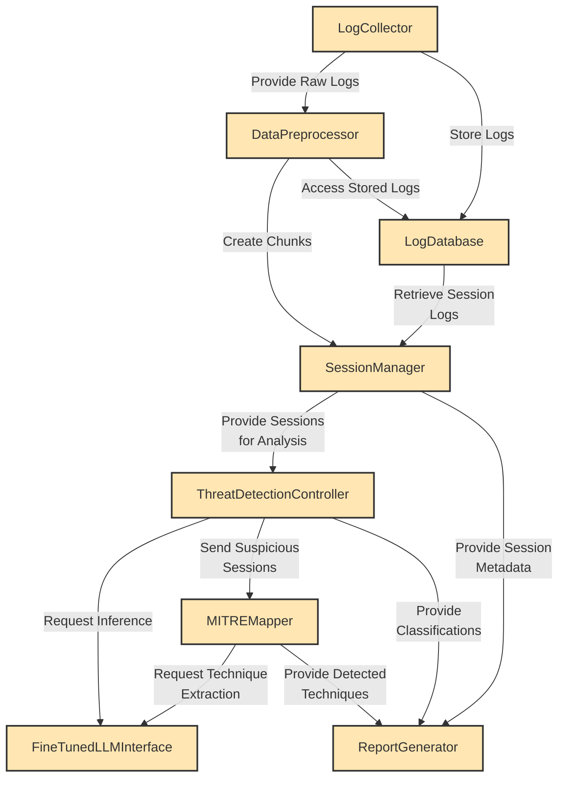

# 5. Class-Based Modeling

Class-based modeling is a visual representation in software engineering that illustrates the structure of a software system using classes, their attributes, and relationships. It is commonly used in object-oriented design and modeling.

## 5.1 Analysis Classes

After identifying nouns from the usage scenario and system architecture, I filtered nouns belonging to the solution domain using General Classification (External entities, Things, Events, Roles, Organizational units, Places, and Structures). Nouns selected as potential classes were filtered using Selection Criteria (Retained information, Needed services, Multiple attributes, Common attributes, Common operations, and Essential requirements). After performing analysis on potential classes, I have found the following analysis classes:

1. **LogCollector**
2. **DataPreprocessor**
3. **ThreatDetectionController**
4. **MITREMapper**
5. **ReportGenerator**
6. **FineTunedLLMInterface**
7. **SessionManager**
8. **LogDatabase**

---

## 5.2 Class Cards

### LogCollector

| **Attributes**                                                                                     | **Methods**                                                                                                                                                                              |
| -------------------------------------------------------------------------------------------------- | ---------------------------------------------------------------------------------------------------------------------------------------------------------------------------------------- |
| - monitored_systems - collection_interval - log_sources - storage_path - active_agents | + start_collection() + stop_collection() + collect_system_logs() + collect_network_traffic() + collect_browser_logs() + upload_to_storage() + validate_log_integrity() |

| **Responsibilities**                                                                                                                    | **Collaborators**                   |
| --------------------------------------------------------------------------------------------------------------------------------------- | ----------------------------------- |
| Continuously monitor target systems and collect logs from multiple sources (Windows Events, Sysmon, network traffic, browser activity). | ● DataPreprocessor ● LogDatabase |

---

### DataPreprocessor

| **Attributes**                                                                           | **Methods**                                                                                                                                                   |
| ---------------------------------------------------------------------------------------- | ------------------------------------------------------------------------------------------------------------------------------------------------------------- |
| - raw_logs - clean_logs - chunk_size - anonymization_rules - schema_mappings | + parse_logs() + remove_duplicates() + normalize_timestamps() + anonymize_pii() + create_chunks() + validate_structure() + export_to_json() |

| **Responsibilities**                                                                                        | **Collaborators**                                   |
| ----------------------------------------------------------------------------------------------------------- | --------------------------------------------------- |
| Transform raw, unstructured logs into clean, standardized JSON format organized into 7-log temporal chunks. | ● LogCollector ● LogDatabase ● SessionManager |

---

### ThreatDetectionController

| **Attributes**                                                                                                         | **Methods**                                                                                                                                              |
| ---------------------------------------------------------------------------------------------------------------------- | -------------------------------------------------------------------------------------------------------------------------------------------------------- |
| - detection_model - confidence_threshold - chunk_embeddings - classification_results - suspicious_sessions | + analyze_session() + generate_embeddings() + classify_activity() + calculate_confidence() + flag_suspicious() + update_detection_model() |

| **Responsibilities**                                                                                                                   | **Collaborators**                                            |
| -------------------------------------------------------------------------------------------------------------------------------------- | ------------------------------------------------------------ |
| Analyze preprocessed log chunks using the fine-tuned LLM to identify anomalous patterns and classify sessions as Normal or Suspicious. | ● FineTunedLLMInterface ● SessionManager ● MITREMapper |

---

### MITREMapper

| **Attributes**                                                                                              | **Methods**                                                                                                                                    |
| ----------------------------------------------------------------------------------------------------------- | ---------------------------------------------------------------------------------------------------------------------------------------------- |
| - mitre_database - technique_catalog - tactic_mappings - extracted_techniques - attack_timeline | + extract_techniques() + map_to_tactics() + query_mitre_db() + identify_iocs() + reconstruct_timeline() + validate_techniques() |

| **Responsibilities**                                                                                                      | **Collaborators**                                                           |
| ------------------------------------------------------------------------------------------------------------------------- | --------------------------------------------------------------------------- |
| For suspicious sessions, extract specific MITRE ATT&CK techniques, map them to tactics, and reconstruct attack timelines. | ● ThreatDetectionController ● FineTunedLLMInterface ● ReportGenerator |

---

### ReportGenerator

| **Attributes**                                                                              | **Methods**                                                                                                                                                                            |
| ------------------------------------------------------------------------------------------- | -------------------------------------------------------------------------------------------------------------------------------------------------------------------------------------- |
| - report_template - threat_data - output_format - report_metadata - risk_levels | + create_executive_summary() + format_technique_list() + generate_timeline() + compile_evidence() + add_recommendations() + export_report() + calculate_risk_score() |

| **Responsibilities**                                                                                                                       | **Collaborators**                                                |
| ------------------------------------------------------------------------------------------------------------------------------------------ | ---------------------------------------------------------------- |
| Generate comprehensive, human-readable threat reports containing detected techniques, timelines, evidence, and actionable recommendations. | ● MITREMapper ● ThreatDetectionController ● SessionManager |

---

### FineTunedLLMInterface

| **Attributes**                                                                       | **Methods**                                                                                                                                  |
| ------------------------------------------------------------------------------------ | -------------------------------------------------------------------------------------------------------------------------------------------- |
| - model_name - tokenizer - max_length - model_weights - inference_config | + load_model() + tokenize_input() + generate_prediction() + extract_techniques() + generate_explanation() + batch_inference() |

| **Responsibilities**                                                                                                       | **Collaborators**                            |
| -------------------------------------------------------------------------------------------------------------------------- | -------------------------------------------- |
| Interface with the fine-tuned Qwen2.5-1.5B-Instruct model to perform threat classification and MITRE technique extraction. | ● ThreatDetectionController ● MITREMapper |

---

### SessionManager

| **Attributes**                                                                                  | **Methods**                                                                                                                                       |
| ----------------------------------------------------------------------------------------------- | ------------------------------------------------------------------------------------------------------------------------------------------------- |
| - active_sessions - session_metadata - chunk_mappings - session_status - timestamps | + create_session() + assign_chunks() + update_session_status() + get_session_data() + merge_related_sessions() + archive_session() |

| **Responsibilities**                                                                                                              | **Collaborators**                                                      |
| --------------------------------------------------------------------------------------------------------------------------------- | ---------------------------------------------------------------------- |
| Organize logs into session-based analysis units, manage session lifecycle, and track analysis progress for each monitored period. | ● DataPreprocessor ● ThreatDetectionController ● ReportGenerator |

---

### LogDatabase

| **Attributes**                                                                                     | **Methods**                                                                                                                            |
| -------------------------------------------------------------------------------------------------- | -------------------------------------------------------------------------------------------------------------------------------------- |
| - raw_log_storage - clean_log_storage - index_mappings - storage_quota - backup_config | + store_raw_logs() + store_clean_logs() + query_logs() + retrieve_session_logs() + create_backup() + manage_retention() |

| **Responsibilities**                                                                                                         | **Collaborators**                                        |
| ---------------------------------------------------------------------------------------------------------------------------- | -------------------------------------------------------- |
| Persist raw and processed logs with proper indexing, manage storage retention policies, and provide efficient log retrieval. | ● LogCollector ● DataPreprocessor ● SessionManager |

---

## 5.3 CRC Diagram

The CRC (Class-Responsibility-Collaboration) diagram illustrating the relationships between classes is shown below:

**Figure 8:** CRC Diagram of MITRE ATT&CK Log Analysis System

**End of Class-Based Modeling Section**
