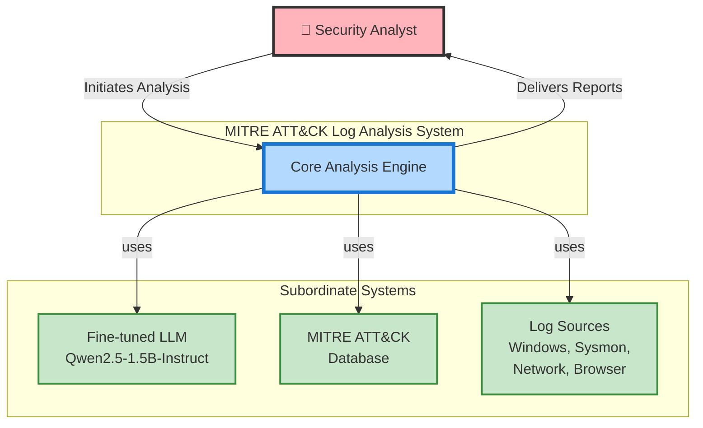
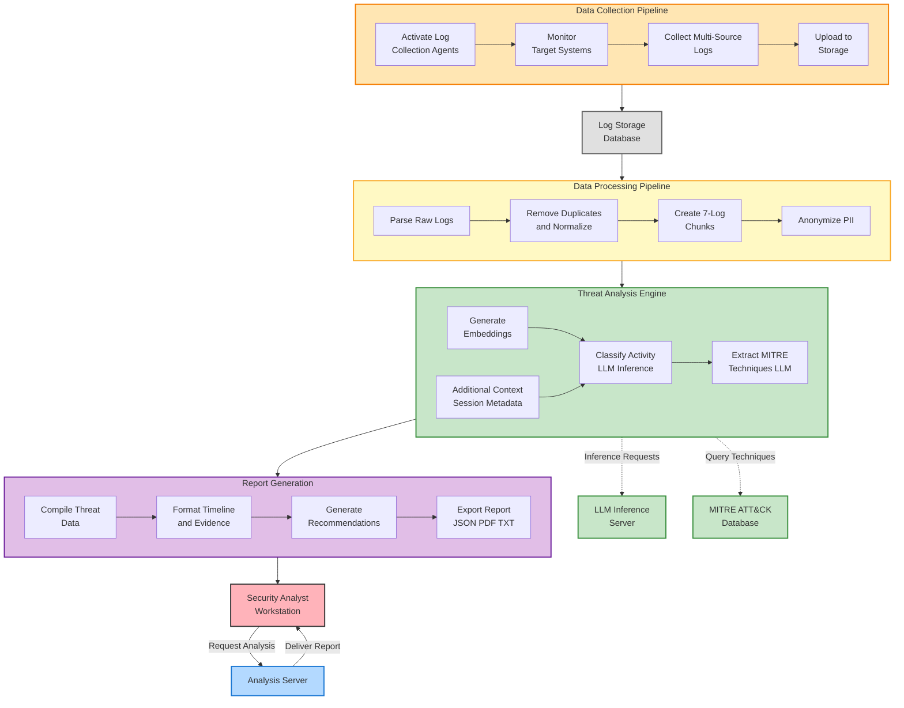
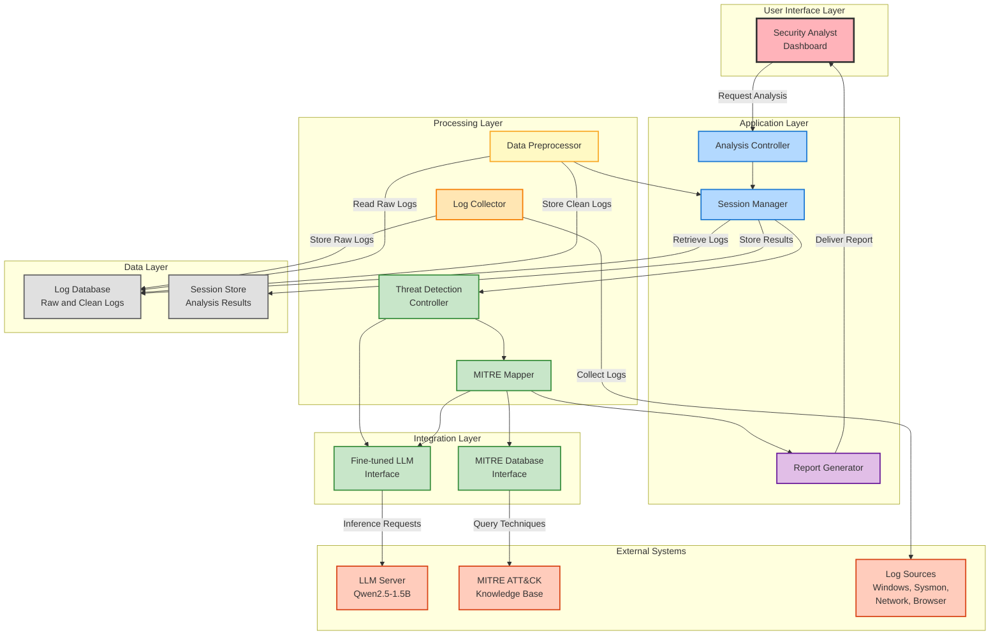

# 6. Architectural Design

Architectural design is a visual representation in software engineering that outlines the high-level structure and organization of a software system. It focuses on defining the major components or modules of the system, their interactions, and the overall system's architecture.

## 6.1 Architectural Context Diagram

At the architectural design level, a software architect uses an architectural context diagram (ACD) to model how software interacts with entities external to its boundaries. Systems that interoperate with the target system are represented as:

- **Superordinate systems** — Those systems that use the target system as part of some higher-level processing scheme.
- **Subordinate systems** — Those systems that are used by the target system and provide data or processing that are necessary to complete target system functionality.
- **Peer-level systems** — Those systems that interact on a peer-to-peer basis (i.e., information is either produced or consumed by the peers and the target system)
- **Actors** — Entities (people, devices) that interact with the target system by producing or consuming information that is necessary for requisite processing.

Each of these external entities communicates with the target system through an interface. Representation of MITRE ATT&CK Log Analysis System in Architectural Context Diagram is delineated as follows:

- **Superordinate systems** - Our system does not have any superordinate system (it operates as a standalone threat detection platform).
- **Subordinate systems** - Our system uses the Fine-tuned LLM for threat detection and technique extraction, MITRE ATT&CK Database for technique validation, and Log Sources (Windows Events, Sysmon, Network Traffic, Browser Logs) as data providers.
- **Peer-level systems** - Our system does not have any peer-level system.
- **Actors** - Security Analysts, SOC Teams, and Incident Responders are the core users of this system.

The architectural context diagram for the system is given below:

**Figure 6:** Architectural Context Diagram

---

## 6.2 Archetypes

The archetypes for the system are defined below:

**Figure 7:** Archetypes

---

This **pipeline-based architecture** is tailored to balance real-time detection with comprehensive threat analysis. The Data Collection and Processing layers ensure that raw logs are transformed into structured, analyzable datasets. The Analysis Engine offloads computationally intensive tasks like LLM inference and MITRE technique extraction to dedicated servers, making the system scalable while maintaining high accuracy. The Reporting layer delivers actionable intelligence to security analysts in human-readable formats.

### Data Collection Pipeline

- **Activate Log Collection Agents:**

  - Deploys automated agents on target systems (Windows, Linux, network devices).
  - Acts as the initial stage to capture security-relevant events in real-time.
  - Ensures comprehensive coverage without impacting system performance.

- **Monitor Target Systems:**

  - Continuously monitors Windows Event Logs, Sysmon, network traffic, and browser activity.
  - Prepares the environment for real-time log streaming.

- **Collect Multi-Source Logs:**

  - Gathers logs from diverse sources (system logs, process execution, network packets, browser history).
  - Efficiently captures all security-relevant events with timestamps.

- **Upload to Storage:**
  - Securely uploads collected logs to cloud storage (Google Drive) or local database.
  - Ensures data integrity and backup for forensic analysis.

---

### Data Processing Pipeline

- **Parse Raw Logs:**

  - Converts heterogeneous log formats (XML, CSV, JSON, binary) into unified JSON structure.
  - Normalizes field names and data types for consistency.

- **Remove Duplicates & Normalize:**

  - Filters out duplicate log entries and system noise.
  - Normalizes timestamps to a consistent format (UTC).

- **Create 7-Log Chunks:**

  - Organizes logs into temporal segments of 7 consecutive events.
  - Optimizes for ML model input (approximately 2,200 tokens per chunk).

- **Anonymize PII:**
  - Strips personally identifiable information (usernames hashed, internal IPs masked).
  - Ensures privacy compliance while preserving forensic value.

---

### Threat Analysis Engine

- **Generate Embeddings:**

  - Converts text-based log chunks into numerical vector representations.
  - Prepares data for machine learning classification.

- **Additional Context (Session Metadata):**

  - Enriches log data with session information (start time, duration, system profile).
  - Provides contextual awareness for more accurate threat detection.

- **Classify Activity (LLM Inference):**

  - Uses the fine-tuned Qwen2.5-1.5B-Instruct model to classify sessions as Normal or Suspicious.
  - Leverages advanced pattern recognition to identify subtle attack indicators.

- **Extract MITRE Techniques (LLM):**
  - For suspicious sessions, extracts specific MITRE ATT&CK technique IDs (e.g., T1059.001, T1547.001).
  - Maps detected behaviors to standardized threat intelligence.

---

### Report Generation

- **Compile Threat Data:**

  - Aggregates classification results, extracted techniques, and session metadata.
  - Prepares comprehensive threat intelligence for reporting.

- **Format Timeline & Evidence:**

  - Constructs chronological attack timeline with precise timestamps.
  - Compiles relevant log excerpts as evidence.

- **Generate Recommendations:**

  - Provides actionable incident response steps (isolate system, investigate lateral movement, etc.).
  - Calculates risk scores based on detected techniques and confidence levels.

- **Export Report (JSON/PDF/TXT):**
  - Exports reports in multiple formats for different audiences.
  - JSON for machine-readable integration, PDF/TXT for human analysis.

---

## 6.3 Top Level Components

The overall architectural structure with top-level components is illustrated below:

**Figure 8:** Top Level Components

---

## 6.4 Mapping Requirements to Software Architecture

The mapping of the derived components with the requirements can be shown below:

| **Requirements**                           | **Components**                                                                                            |
| ------------------------------------------ | --------------------------------------------------------------------------------------------------------- |
| **Automated Log Collection**               | Activate Log Collection Agents, Monitor Target Systems, Collect Multi-Source Logs, Upload to Storage      |
| **Good Detection Accuracy**                | Generate Embeddings, Classify Activity (LLM Inference), Calculate Confidence, Threat Detection Controller |
| **MITRE ATT&CK Mapping**                   | Extract MITRE Techniques (LLM), MITRE Mapper, MITRE Database Interface, Query Techniques                  |
| **Timestamped Event Logs**                 | Collect Multi-Source Logs, Parse Raw Logs, Normalize Timestamps, Format Timeline & Evidence               |
| **Privacy Protection**                     | Anonymize PII, Data Preprocessor, Secure Storage                                                          |
| **Context-Aware Detection**                | Additional Context (Session Metadata), Session Manager, Retrieve Contextual Data                          |
| **Detailed Threat Explanations**           | Generate Recommendations, Compile Threat Data, Report Generator, Export Report                            |
| **Fast Processing Speed**                  | Create 7-Log Chunks, Batch Inference, LLM Interface, Parallel Processing                                  |
| **Comprehensive Reporting**                | Format Timeline & Evidence, Compile Threat Data, Generate Recommendations, Export Report (JSON/PDF/TXT)   |
| **Multi-Source Log Integration**           | Log Collector, Parse Raw Logs, Remove Duplicates & Normalize, Log Database                                |
| **Fine-Tuned Language Model**              | Fine-tuned LLM Interface, LLM Server (Qwen2.5-1.5B), Generate Embeddings, Classify Activity               |
| **Automated MITRE Technique Extraction**   | Extract MITRE Techniques (LLM), MITRE Mapper, Validate Techniques                                         |
| **Explainable AI with Reasoning**          | Generate Recommendations, Compile Threat Data, Format Timeline & Evidence                                 |
| **Multi-Stage Attack Pattern Recognition** | Session Manager, Create 7-Log Chunks, Classify Activity, Extract MITRE Techniques                         |
| **Session-Based Analysis**                 | Session Manager, Create Session, Assign Chunks, Update Session Status                                     |

---

## Conclusion

In the current report, I have detailed all the necessary technical specifications required to develop the MITRE ATT&CK Log Analysis System: an intelligent threat detection platform designed to automate the analysis of system, process, and network logs. I have elaborated on the project scope, requirements, and usage scenarios in detail. Scenario-based modeling and class-based modeling were conducted to establish a resilient system architecture. In addition, the architectural design has been presented to illustrate the high-level structure and component interactions.

While the MITRE ATT&CK Log Analysis System can effectively detect and explain suspicious activities by leveraging advanced machine learning and the MITRE framework, there is always room for improvement. Future enhancements could include: supporting additional log sources (cloud platforms like AWS CloudTrail, Azure Monitor), integrating with SIEM platforms for real-time alerting, expanding technique coverage to include emerging threats, and incorporating user feedback mechanisms to continuously refine the detection model.

This document should provide a comprehensive understanding of the workflow, technical design, and architectural structure of this system. I hope it will serve as a valuable resource for understanding the MITRE ATT&CK Log Analysis System and its development process.

---

**End of Architectural Design Section**
